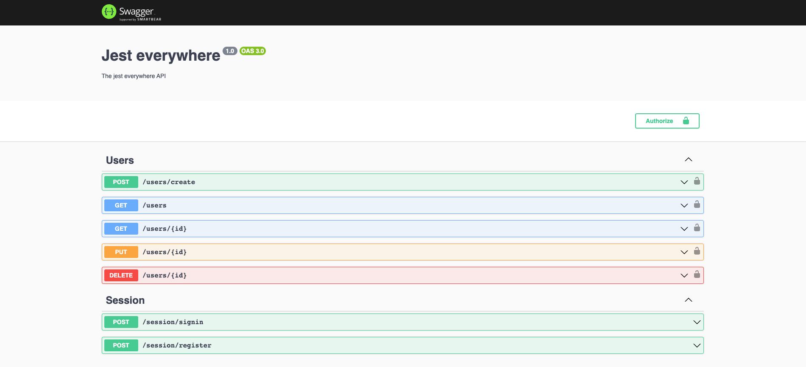

<p align="center">
    
</p>
<p align="center">
    
    
    <a href="https://twitter.com/wellers0n_" target="_blank">
        
    </a>
</p>

<p>
   <h1 align="center">Jest-everywhere</h1>
<p/>
    
<br/>

## Fullstack typescript/javascript

Jest-everywhere uses a stack full `JS/TS` on the frontend and backend, I'm making this project to improve
my skills!

## Node version

Use node `v18.12.1`

## Initiating in the your PC

- For clone the project `git clone https://github.com/Wellers0n/jest-everywhere.git`
- Enter in the folder `cd jest-everywhere/`

## Install dependencies

```sh
yarn
```

## Init application

Init docker-compose

At the root directory, run the following command:

### docker-compose

```sh
 docker-compose up -d
```

run application:

```sh
 yarn start
```

## Run migrations and seed

- NOTE: Wait for docker-compose or start postgres locally, to run the following command

```sh
yarn migration:deploy
```

## Listening in

frontend port: `http://localhost:3000`

backend port: `http://localhost:3001`

## API Docs

Visit [http://localhost:3001/docs/](http://localhost:3001/docs/) for more information about the documentation

 

## Stack used

[NextJS](https://nextjs.org/)<br/>
[NestJS](https://nestjs.com/)<br/>
[Postgresql](https://www.postgresql.org/)<br/>
[Docker](https://www.docker.com/)<br/>
[Jest](https://jestjs.io/pt-BR/)<br/>
[Swagger](https://swagger.io/)<br/>
[Docker-compose](https://docs.docker.com/compose/)<br/>
[Yarn](https://yarnpkg.com/en/)<br/>
[WorkSpaces](https://yarnpkg.com/lang/en/docs/workspaces/)<br/>
[Material-IU](https://mui.com/)<br/>
